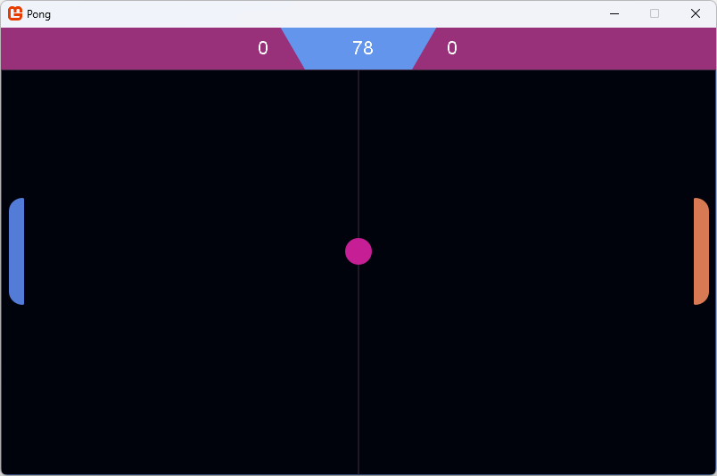
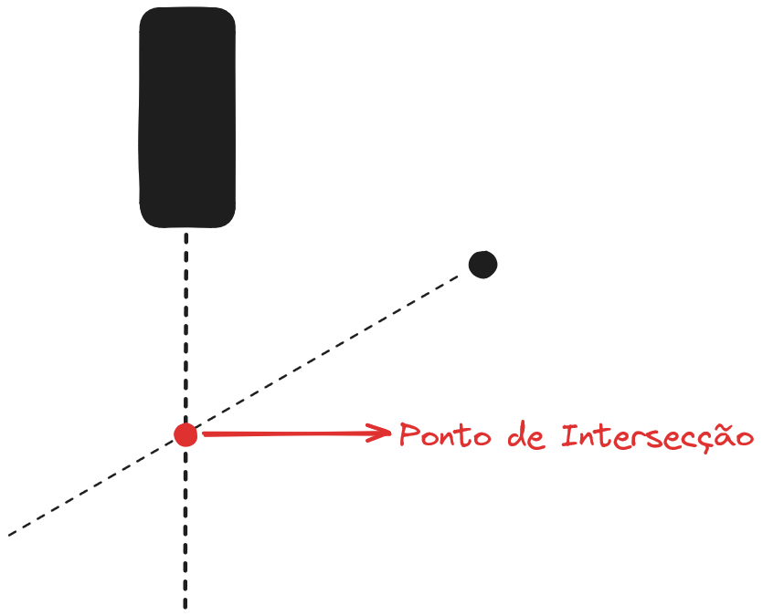

# Pong

Esse é um clone do jogo Pong feito em C# com a engine [MonoGame](https://monogame.net/).

## Inteligência Artificial do Inimigo

Calculamos o ponto de intersecção do Paddle com a bola, assim sabemos para onde ir.

O ponto de interseção $(x, y)$ entre dois segmentos de linha $AB$ e $CD$ pode ser encontrado usando as seguintes fórmulas:

\[
\text{denominador} = (x_A - x_B) \times (y_C - y_D) - (y_A - y_B) \times (x_C - x_D)
\]

Se $\text{denominador} = 0$, as linhas são paralelas e não há ponto de interseção.

Caso contrário, calcule:

\[
t = \frac{(x_A - x_C) \times (y_C - y_D) - (y_A - y_C) \times (x_C - x_D)}{\text{denominador}}
\]

\[
u = -\frac{(x_A - x_B) \times (y_A - y_C) - (y_A - y_B) \times (x_A - x_C)}{\text{denominador}}
\]

Se $t$ e $u$ estiverem ambos no intervalo $[0, 1]$, então o ponto de interseção está dentro dos segmentos de linha, e suas coordenadas são:

\[
x = x_A + t \times (x_B - x_A)
\]

\[
y = y_A + t \times (y_B - y_A)
\]

A partir daqui, mudamos o tempo de reação do inimigo de acordo com suas vitórias e derrotas. Se estiver ganhando muito, aumentamos o tempo de reação, facilitando o jogo, se estiver ganhando pouco diminuimos o tempo de reação, dificultando o jogo. Com isso temos um jogo que permanece balanceado.

## Créditos

- Arte por [Esoe B.Studios](https://myebstudios.itch.io/)
- Efeitos sonoros por [NoiseCollector](https://freesound.org/people/NoiseCollector/)
